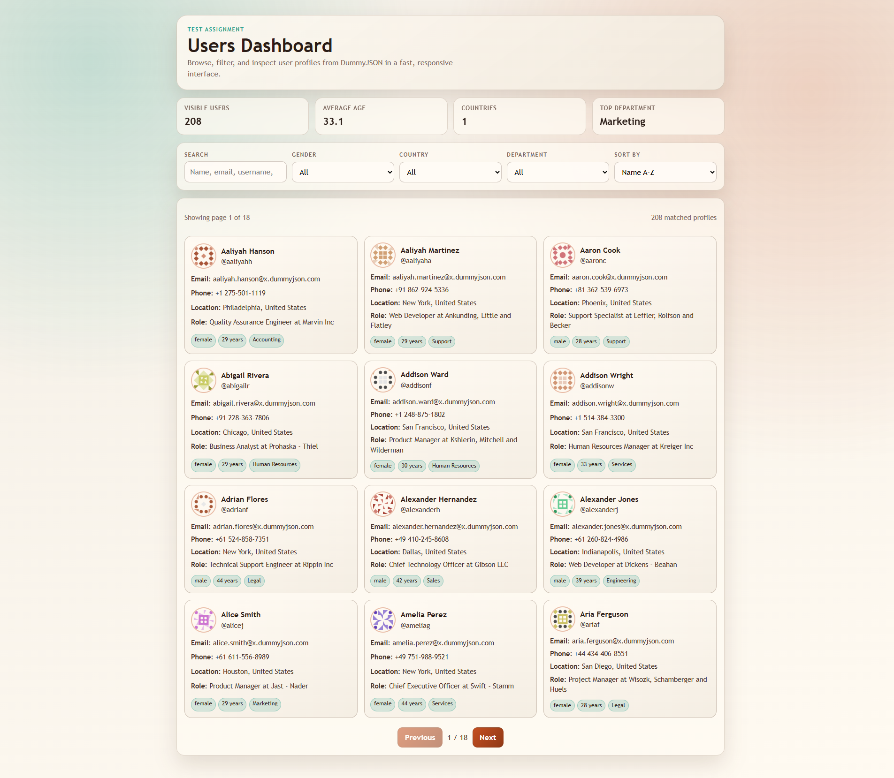

# Users Dashboard

Test assignment implementation for a users dashboard using DummyJSON.

- API: https://dummyjson.com/users
- Docs: https://dummyjson.com/docs/users

## Stack

- React
- TypeScript
- Vite

## What I built

A responsive users dashboard with:

- API fetch from DummyJSON users endpoint
- Loading and error states
- Search by name, email, username, and company
- Filter by gender
- Filter by country
- Filter by department
- Sorting (name and age, both directions)
- Pagination (12 users per page)
- Summary stats:
  - visible users
  - average age
  - number of countries in current result set
  - top department in current result set
- Responsive card layout for desktop/tablet/mobile

## Screenshot



## Why I did it this way

I chose React + TypeScript because this stack is productive for assignment scope while still showing structure and correctness:

- React hooks (`useMemo`, `useEffect`, `useState`) keep state transitions explicit and predictable.
- TypeScript types for API data reduce runtime guesswork and improve maintainability.
- Local computed state (search/filter/sort/page) keeps UI fast and avoids unnecessary network calls.
- The dashboard is designed to demonstrate practical product behavior instead of only rendering raw API data.

I also made the visual direction intentionally distinctive (warm palette, glass-style cards, animated sections) so it does not look like default template UI.

## Run locally

```bash
npm install
npm run dev
```

Build for production:

```bash
npm run build
```
